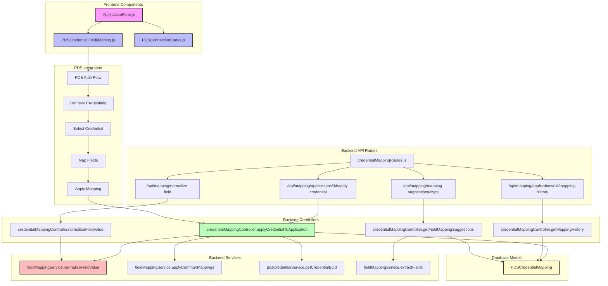

```mermaid
graph TD
    subgraph "Frontend Components"
        A[ApplicationForm.js] --> B[PDSCredentialFieldMapping.js]
        A --> C[PDSConnectionStatus.js]
    end
    
    subgraph "Backend API Routes"
        D[credentialMappingRoutes.js] --> E["/api/mapping/applications/:id/apply-credential"]
        D --> F["/api/mapping/applications/:id/mapping-history"]
        D --> G["/api/mapping/mapping-suggestions/:type"]
        D --> H["/api/mapping/normalize-field"]
    end
    
    subgraph "Backend Controllers"
        E --> I[credentialMappingController.applyCredentialToApplication]
        F --> J[credentialMappingController.getMappingHistory]
        G --> K[credentialMappingController.getFieldMappingSuggestions]
        H --> L[credentialMappingController.normalizeFieldValue]
    end
    
    subgraph "Backend Services"
        I --> M[fieldMappingService.normalizeFieldValue]
        I --> N[fieldMappingService.applyCommonMappings]
        I --> O[pdsCredentialService.getCredentialById]
        K --> P[fieldMappingService.extractFields]
        L --> M
    end
    
    subgraph "Database Models"
        I --> Q[PDSCredentialMapping]
        J --> Q
        K --> Q
    end
    
    subgraph "PDS Integration"
        B --> R[PDS Auth Flow]
        R --> S[Retrieve Credentials]
        S --> T[Select Credential]
        T --> U[Map Fields]
        U --> V[Apply Mapping]
        V --> I
    end
    
    style A fill:#f9f,stroke:#333,stroke-width:2px
    style B fill:#bbf,stroke:#333,stroke-width:2px
    style C fill:#bbf,stroke:#333,stroke-width:2px
    style I fill:#bfb,stroke:#333,stroke-width:2px
    style M fill:#fbb,stroke:#333,stroke-width:2px
    style Q fill:#fffacd,stroke:#333,stroke-width:2px
```
